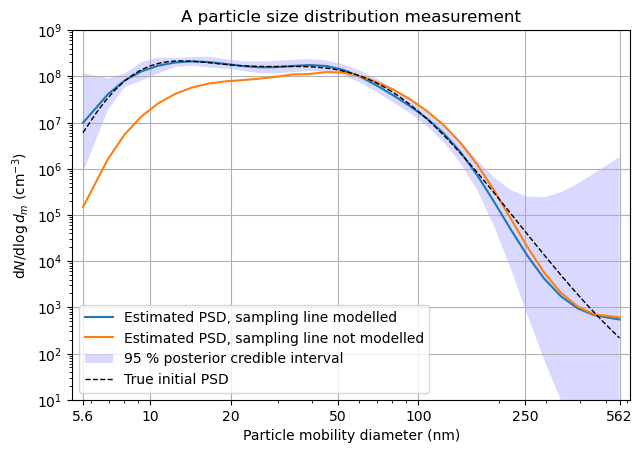
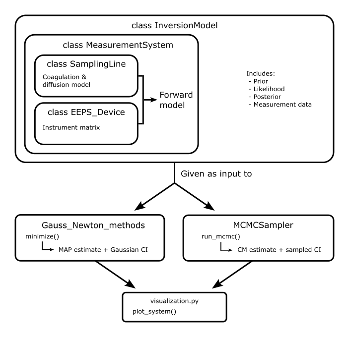

# SLIC - Sampling Line Inversion with Coagulation
Coagulation and wall losses in sampling lines alter the particle size distribution (PSD) of an aerosol sample and hence, what you measure may not be what you sampled.

Using SLIC, one can model the coagulation and wall diffusion processes that alter the PSD, and then use Bayesian inversion methods to estimate the initial, unaltered, PSD. SLIC will also quantify the uncertainty related to the estimates.



See the accompanying paper for more details.

Installing
---
SLIC is a collection of Python modules that only need their dependencies installed to work. This code has been tested in a [conda](https://docs.anaconda.com/miniconda/) environment using the [Spyder](https://www.spyder-ide.org/) IDE. Should work elsewhere, too. First, clone (or download) the repository from github:
```
git clone https://github.com/mniskanen/sampling-line-inversion.git
```
 and then install the required packages:
```
pip install -r requirements.txt
```
Usage
---
In the ``src/``-folder there are three scripts that go through the whole inversion process from loading data to visualizations. Running these is a good way to start to get familiar with the codes:
- ``invert_synthetic.py``: Generates synthetic data, computes the Laplace approximation, and plots the results.
- ``invert_AHmeasurements.py``: Loads the included measurement data, computes the Laplace approximation, and plots the results.
- ``create_figures_paper.py``: Calculates the Laplace approximations and samples the posterior using MCMC for synthetic and real data to reproduce all the plots in the accompanying paper.

The following schematic may be helpful in understanding the code structure:



License
---

Copyright 2024 Matti Niskanen.

SLIC is free software made available under the MIT License. For details see the LICENSE file.
